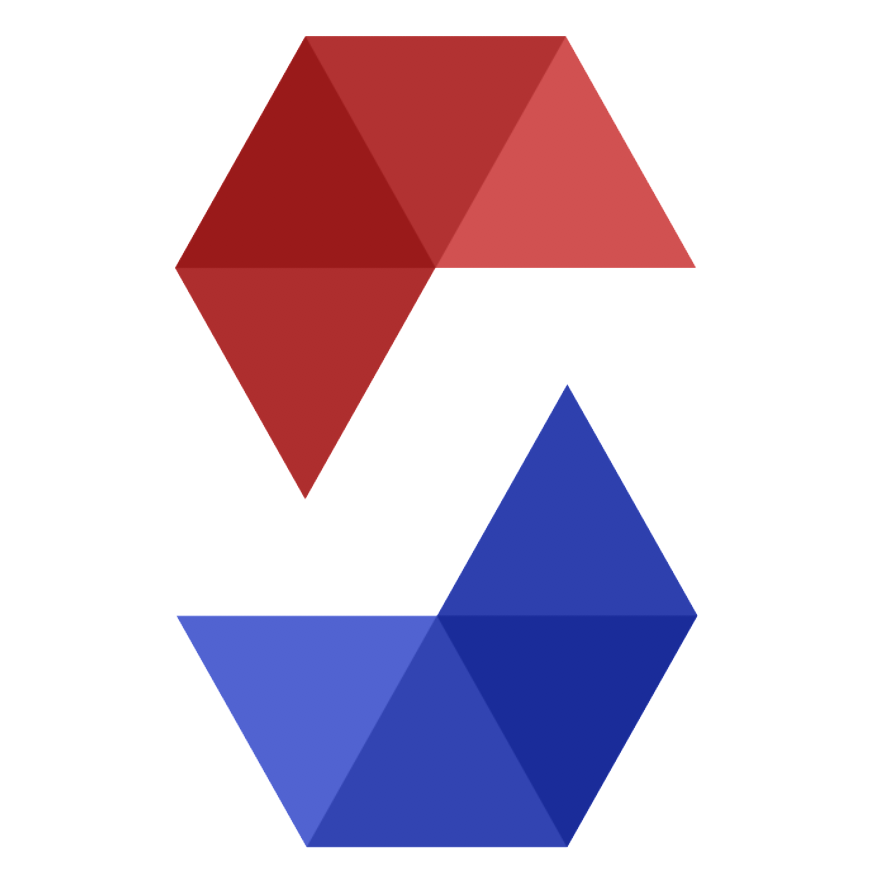
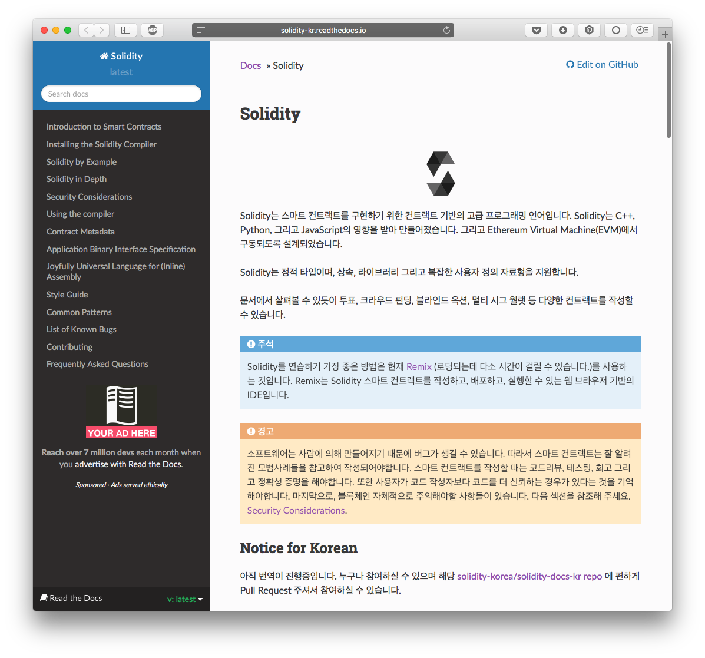

## Solidity 공식 문서 한글 번역



### Link: [http://solidity-kr.readthedocs.io](http://solidity-kr.readthedocs.io/ko/latest/)

[Solidity 공식 문서](http://solidity.readthedocs.io/en/latest/) 의 한글 번역을 진행합니다.



## contributions

누구나 해당 repository 에 pull request 를 통해 참여하실 수 있습니다.  
Solidity 문서 번역에 도움을 주실 분들은 이 코드저장소를 **Fork**하셔서 수정하시고 pull request를 보내주세요.

문서는 **rst**(Restructured Text)로 작성되어있으며 [[링크]](http://docutils.sourceforge.net/docs/user/rst/quickref.html)에서 문법을 확인할 수 있습니다.

일관된 번역을 위해서 다음 규칙을 권장합니다.

- 문서의 내용이 친근하게 다가올 수 있도록 **경어체를 사용**하여 번역합니다.
- 고유명사는 원문 그대로 사용합니다. (예, *solidity*, *ethereum*)
- 기술용어 / 합성어는 음역으로 표시합니다. (예, <del>smart contract</del>, 스마트 컨트렉트)

#### Translation Issue
여러 사람이 같은 부분을 동시에 번역하는 상황을 피하기 위해 번역을 시작하기 전, 이슈를 등록해하여 assign 한 후 PR을 올리는 방식으로 진행합니다. 해당 이슈는 PR이 merge 된 후, close 합니다.  
가독성을 위해 제목 앞에 다음 중 하나의 태그를 작성 해주세요. `[번역]`, `[오탈자 수정]`, `[제안]`, `[공지]`, `[기타]`  
issue 양식은 아래와 같습니다.  
```
📋 섹션
- (문서상 섹션명)
- (파일명)

📅 마감일
- (년도.월.일)

💬 추가 내용
```

자세한 내용는 해당 [문서](https://github.com/solidity-korea/solidity-docs-kr/wiki/%EA%B8%B0%EC%97%AC%ED%95%98%EA%B8%B0)를 참고해주세요.

- 현재 [이미 진행된 번역본과 통합](https://github.com/solidity-korea/solidity-docs-kr/issues/10) 이슈에 따라 https://ggs134.gitbooks.io/solidityguide/content/ 와 통합하는 과정을 진행하고 있습니다. 완전히 통합이 완료되기 전 까지는 위 [링크](https://ggs134.gitbooks.io/solidityguide/content/) 에서 번역 유무 확인하셔서 이미 번역이 진행된 부분을 피해서 진행해 주시면 중복 번역을 최소화 할 수 있을 것 같습니다.

- 2018년 12월 7일 기준 0.5.1번 버전과의 통합을 진행하고 있습니다. [41번 이슈](https://github.com/solidity-korea/solidity-docs-kr/issues/41)에서 자세한 사항을 확인할 수 있습니다.

- 2018년 12월 19일 기준 0.5.1 버전과의 통합이 완료되었습니다. [51번 이슈](https://github.com/solidity-korea/solidity-docs-kr/issues/51)를 통해 자세한 사항을 확인 할 수 있습니다.

- Project의 Check List에 존재하는 모든 문서는 번역이 진행되지 않은 문서이거나, 0.4.2 버전을 기반으로 번역된 문서이므로, 업데이트가 필요합니다. [이 사이트](https://www.diffchecker.com/cblLjeFw)를 통하여, 0.4.2 버전 원본문서와 0.5.1 버전의 문서를 비교하여, 업데이트가 된 부분을 수정 부탁드립니다.


## Project Management
[여기](https://github.com/solidity-korea/solidity-docs-kr/projects/1)를 통해 Check List에서 본인이 번역을 진행하고 있는 문서를 In Progress로 이동시켜 주시기 바랍니다. 또한 내용 수정을 통해 관련 Issue Number를 추가해 주시기 바랍니다. 번역이 완료되고, Merge가 된 후에는 In progress 에서 Done으로 이동시켜 주시기 바랍니다.


## Communication 
Solidity Korea Slack 채널을 운영하고 있습니다. 보다 활성화된 커뮤니케이션이 필요하신 분은 해당 [링크](https://join.slack.com/t/solidity-korea/shared_invite/enQtMzMyNjA0MDMxNTU4LTM2NTI2MjgzNTQ5MDQ5OGM2ZjkzMjc3OTM1NzVkODI4MTFkZTcwZTQxNGRjZTg5N2M2MWQzZWNjZTBmZDEzNDU) 를 통해 참여하실 수 있습니다.

주최: [Solidity Korea: 한국 솔리디티 개발자 그룹](http://solidity.kr)
